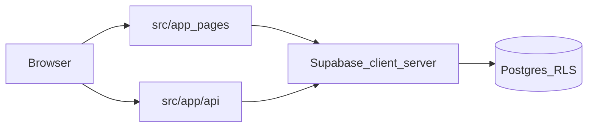

# Indice progetto 22Club

Mappa operativa del **codice vivo** per orientarsi su route, API, librerie e hook. Non sostituisce la ricerca semantica dell’IDE; va aggiornato quando si aggiungono aree grandi o si spostano entry point.

- **Ultimo aggiornamento:** 2026-04-03 (`/embed/athlete-allenamenti/[athleteProfileId]`: `loading.tsx` + `EmbedAthleteAllenamentiPageSkeleton`; fallback Suspense pagine embed)
- **Obbligo di manutenzione:** criteri completi in `.cursor/rules/22club-project-rules.mdc` (sezione **NAVIGAZIONE CODICE**): allineare l’indice e questa data quando cambiano route, API o puntatori documentati; ogni modifica a questo file aggiorna la data in meta.
- **Come aggiornare:** rigenerare elenchi route/API (vedi sotto) e allineare i puntatori per dominio; stack e divieti DB restano in `.cursor/rules/22club-project-rules.mdc`.

## Rigenerazione rapida (PowerShell, dalla root repo)

```powershell
# Route UI (path dopo src/app)
Get-ChildItem -Path ".\src\app" -Recurse -Filter "page.tsx" | ForEach-Object {
  $r = $_.FullName -replace [regex]::Escape((Resolve-Path ".\src\app").Path), "" -replace "\\page.tsx$","" -replace "\\","/"
  if ($r -eq "") { "/" } else { $r }
} | Sort-Object

# API
Get-ChildItem -Path ".\src\app\api" -Recurse -Filter "route.ts" | ForEach-Object {
  ($_.FullName -replace [regex]::Escape((Resolve-Path ".\src\app").Path), "" -replace "\\route.ts$","" -replace "\\","/") -replace "^/api","/api"
} | Sort-Object
```

## Nota sulla struttura

Nelle regole di progetto compaiono percorsi generici (`app/`, `components/`, `lib/`). Nel repository il codice applicativo è sotto **`src/`** (es. `src/app`, `src/lib`, `src/components`).

---

## Cartelle top-level (codice vivo)

| Percorso          | Contenuto                                                       |
| ----------------- | --------------------------------------------------------------- |
| `src/app/`        | App Router: `page.tsx`, `layout.tsx`, `api/`                    |
| `src/components/` | UI per dominio (dashboard, chat, workout, …)                    |
| `src/hooks/`      | Hook React (root + sottocartelle per dominio)                   |
| `src/lib/`        | Logica condivisa, Supabase client/server, validazioni, email, … |
| `src/types/`      | Tipi TypeScript                                                 |
| `supabase/`       | `migrations/`, `functions/` (Edge), `config.toml`               |
| `e2e/`            | Playwright                                                      |
| `tests/`          | Test unitari / integrazione                                     |

**Componenti (cartelle principali in `src/components/`):** `appointments`, `athlete`, `auth`, `calendar`, `charts`, `chat`, `communications`, `dashboard`, `documents`, `home`, `home-profile`, `invitations`, `layout` (incl. `route-loading-skeletons.tsx`: `HomeAthletePageContentSkeleton` (`src/app/home/loading.tsx`), `HomeAthleteSegmentSkeleton`, `StaffDashboardSegmentSkeleton`, `StaffDashboardGuardSkeleton`, `StaffStaffPageContentSkeleton`, `StaffAthleteSegmentSkeleton`, `StaffAdminSegmentSkeleton`, `StaffMarketingSegmentSkeleton`, `StaffMarketingDataBlockSkeleton` + `src/app/dashboard/atleti/[id]/loading.tsx`, `src/app/dashboard/admin/loading.tsx`, `src/app/dashboard/massaggiatore/loading.tsx`, `src/app/dashboard/marketing/loading.tsx`, `EmbedAthleteAllenamentiPageSkeleton` + `src/app/embed/athlete-allenamenti/[athleteProfileId]/loading.tsx`, `StaffLazyChunkFallback`, `loading.tsx` App Router, fallback Suspense in `src/app/dashboard/layout.tsx` e in pagine staff con chunk lazy), `settings`, `shared` (incl. `shared/dashboard/role-layout.tsx` — guscio staff stabile senza animazione che rimonta l’albero), `ui`, `workout`, `workout-plans`, …

---

## Flusso ad alto livello



---

## Route UI (`src/app/**/page.tsx`)

### `/` e pubblici / legali

| Route                  |
| ---------------------- |
| `/`                    |
| `/login`               |
| `/registrati`          |
| `/forgot-password`     |
| `/reset-password`      |
| `/post-login`          |
| `/welcome`             |
| `/privacy`             |
| `/termini`             |
| `/sentry-example-page` |

### Design system

| Route            |
| ---------------- |
| `/design-system` |

### Dashboard (staff) — generale

| Route                                |
| ------------------------------------ |
| `/dashboard`                         |
| `/dashboard/clienti`                 |
| `/dashboard/appuntamenti`            |
| `/dashboard/prenotazioni`            |
| `/dashboard/prenotazioni/atleti/[id]` |
| `/dashboard/calendario`              |
| `/dashboard/calendario/impostazioni` |
| `/dashboard/chat`                    |
| `/dashboard/comunicazioni`           |
| `/dashboard/comunicazioni/template`  |
| `/dashboard/documenti`               |
| `/dashboard/database`                |
| `/dashboard/esercizi`                |
| `/dashboard/workouts`                |
| `/dashboard/allenamenti`             |
| `/dashboard/schede`                  |
| `/dashboard/schede/nuova`            |
| `/dashboard/schede/[id]/modifica`    |
| `/dashboard/abbonamenti`             |
| `/dashboard/pagamenti`               |
| `/dashboard/pagamenti/atleta/[athleteId]` |
| `/dashboard/statistiche`             |
| `/dashboard/impostazioni`            |
| `/dashboard/profilo`                 |
| `/dashboard/invita-atleta`           |
| `/dashboard/atleti/[id]`             |
| `/dashboard/atleti/[id]/progressi`   |
| `/dashboard/atleti/[id]/progressi/misurazioni` |
| `/dashboard/atleti/[id]/progressi/misurazioni/[field]` |
| `/dashboard/atleti/[id]/progressi/allenamenti` |
| `/dashboard/atleti/[id]/progressi/allenamenti/[exerciseId]` |
| `/dashboard/atleti/[id]/progressi/storico` *(hub panoramica, `AthleteWorkoutsTab` `hubSection=overview`)* |
| `/dashboard/atleti/[id]/progressi/storico/schede` |
| `/dashboard/atleti/[id]/progressi/storico/sessioni-aperte` |
| `/dashboard/atleti/[id]/progressi/storico/appuntamenti` |
| `/dashboard/atleti/[id]/progressi/storico/completati` |
| `/dashboard/atleti/[id]/progressi/foto` |

### Dashboard — marketing

| Route                                      |
| ------------------------------------------ |
| `/dashboard/marketing`                     |
| `/dashboard/marketing/analytics`           |
| `/dashboard/marketing/athletes`            |
| `/dashboard/marketing/impostazioni`        |
| `/dashboard/marketing/report`              |
| `/dashboard/marketing/leads`               |
| `/dashboard/marketing/leads/[id]`          |
| `/dashboard/marketing/campaigns`           |
| `/dashboard/marketing/campaigns/new`       |
| `/dashboard/marketing/campaigns/[id]`      |
| `/dashboard/marketing/campaigns/[id]/edit` |
| `/dashboard/marketing/segments`            |
| `/dashboard/marketing/segments/new`        |
| `/dashboard/marketing/segments/[id]`       |
| `/dashboard/marketing/segments/[id]/edit`  |
| `/dashboard/marketing/automations`         |
| `/dashboard/marketing/automations/new`     |
| `/dashboard/marketing/automations/[id]`    |

### Dashboard — nutrizionista

| Route                                   |
| --------------------------------------- |
| `/dashboard/nutrizionista`              |
| `/dashboard/nutrizionista/atleti`       |
| `/dashboard/nutrizionista/atleti/[id]`  |
| `/dashboard/nutrizionista/calendario`   |
| `/dashboard/nutrizionista/chat`         |
| `/dashboard/nutrizionista/checkin`      |
| `/dashboard/nutrizionista/checkin/[id]` |
| `/dashboard/nutrizionista/documenti`    |
| `/dashboard/nutrizionista/piani`        |
| `/dashboard/nutrizionista/piani/nuovo`  |
| `/dashboard/nutrizionista/progressi`    |
| `/dashboard/nutrizionista/analisi`      |
| `/dashboard/nutrizionista/abbonamenti`  |
| `/dashboard/nutrizionista/impostazioni` |

### Dashboard — massaggiatore

| Route                                   |
| --------------------------------------- |
| `/dashboard/massaggiatore`              |
| `/dashboard/massaggiatore/appuntamenti` |
| `/dashboard/massaggiatore/calendario`   |
| `/dashboard/massaggiatore/chat`         |
| `/dashboard/massaggiatore/abbonamenti`  |
| `/dashboard/massaggiatore/statistiche`  |
| `/dashboard/massaggiatore/profilo`      |
| `/dashboard/massaggiatore/impostazioni` |

### Dashboard — admin

| Route                               |
| ----------------------------------- |
| `/dashboard/admin`                  |
| `/dashboard/admin/utenti`           |
| `/dashboard/admin/utenti/marketing` |
| `/dashboard/admin/ruoli`            |
| `/dashboard/admin/organizzazioni`   |
| `/dashboard/admin/statistiche`      |

### Home atleta / area personale (`/home`)

| Route                                      |
| ------------------------------------------ |
| `/home`                                    |
| `/home/profilo`                            |
| `/home/chat`                               |
| `/home/appuntamenti`                       |
| `/home/documenti`                          |
| `/home/pagamenti`                          |
| `/home/trainer`                            |
| `/home/nutrizionista`                      |
| `/home/massaggiatore`                      |
| `/home/allenamenti`                        |
| `/home/allenamenti/oggi`                   |
| `/home/allenamenti/riepilogo`              |
| `/home/allenamenti/[id]`                   |
| `/home/allenamenti/[id]/giorno/[dayId]`    |
| `/home/allenamenti/esercizio/[exerciseId]` |
| `/home/progressi`                          |
| `/home/progressi/nuovo`                    |
| `/home/progressi/allenamenti`              |
| `/home/progressi/allenamenti/[exerciseId]` |
| `/home/progressi/misurazioni`              |
| `/home/progressi/misurazioni/[field]`      |
| `/home/progressi/storico`                  |
| `/home/progressi/foto`                     |
| `/home/foto-risultati`                     |
| `/home/foto-risultati/aggiungi`            |

### Embed — vista atleta per trainer (riuso UI atleta)

Stessa UI di `home/allenamenti/*` con `AthleteAllenamentiPreviewProvider`; accesso middleware: solo **trainer** e **admin**. Su `/dashboard/workouts` la vista staff è **due colonne native** (parallel routes `@slot1` / `@slot2`) con query per slot `p1`, `p2` (due `profiles.id`); `embed/athlete-allenamenti/*` resta per iframe / contesti esterni.

| Route |
| ----- |
| `/embed/athlete-allenamenti/[athleteProfileId]` |
| `/embed/athlete-allenamenti/[athleteProfileId]/[id]` |
| `/embed/athlete-allenamenti/[athleteProfileId]/[id]/giorno/[dayId]` |
| `/embed/athlete-allenamenti/[athleteProfileId]/oggi` |
| `/embed/athlete-allenamenti/[athleteProfileId]/riepilogo` |
| `/embed/athlete-allenamenti/[athleteProfileId]/esercizio/[exerciseId]` |

---

## API Route Handlers (`src/app/api/**/route.ts`)

Prefisso HTTP: ogni file corrisponde a `GET/POST/...` su `https://<host><path>`.

### `/api/admin/*`

| Path                                     |
| ---------------------------------------- |
| `/api/admin/athletes/assign-trainer`     |
| `/api/admin/cron/refresh-marketing-kpis` |
| `/api/admin/impersonation/start`         |
| `/api/admin/impersonation/stop`          |
| `/api/admin/roles`                       |
| `/api/admin/statistics`                  |
| `/api/admin/users`                       |
| `/api/admin/users/assignments`           |
| `/api/admin/users/marketing`             |
| `/api/admin/users/trainer`               |

### `/api/athletes/*` e atleta

| Path                                 |
| ------------------------------------ |
| `/api/athletes/create`               |
| `/api/athletes/[id]`                 |
| `/api/athlete/workout-plans`         |
| `/api/athlete/progress-logs`         |
| `/api/athlete/coached-session-debit` |

### `/api/staff/*`

| Path |
| ---- |
| `/api/staff/athlete-workout-plans` |
| `/api/staff/progress-logs/[id]` |
| `/api/staff/workout-logs/[id]/finalize-in-progress` |

### `/api/auth/*`

| Path                        |
| --------------------------- |
| `/api/auth/context`         |
| `/api/auth/forgot-password` |

### `/api/calendar/*`

| Path                                      |
| ----------------------------------------- |
| `/api/calendar/notify-appointment-change` |
| `/api/calendar/send-appointment-reminder` |

### `/api/clienti/*`

| Path                          |
| ----------------------------- |
| `/api/clienti/sync-pt-atleti` |

### `/api/communications/*`

| Path                                        |
| ------------------------------------------- |
| `/api/communications/check-stuck`           |
| `/api/communications/list`                  |
| `/api/communications/list-athletes`         |
| `/api/communications/recipients`            |
| `/api/communications/recipients/count`      |
| `/api/communications/send`                  |
| `/api/communications/send-email-to-athlete` |

### `/api/dashboard/*`

| Path                          |
| ----------------------------- |
| `/api/dashboard/appointments` |

### Altri singoli

| Path                                     |
| ---------------------------------------- |
| `/api/debug-trainer-visibility`          |
| `/api/document-preview`                  |
| `/api/exercises`                         |
| `/api/health`                            |
| `/api/nutritionist/extract-progress-pdf` |
| `/api/register/complete-profile`         |
| `/api/sentry-example-api`                |

### `/api/invitations/*`

| Path                            |
| ------------------------------- |
| `/api/invitations`              |
| `/api/invitations/create`       |
| `/api/invitations/email-status` |
| `/api/invitations/send-email`   |

### `/api/marketing/*`

| Path                                   |
| -------------------------------------- |
| `/api/marketing/analytics`             |
| `/api/marketing/athletes`              |
| `/api/marketing/automations/[id]`      |
| `/api/marketing/automations/[id]/run`  |
| `/api/marketing/events`                |
| `/api/marketing/kpi`                   |
| `/api/marketing/leads`                 |
| `/api/marketing/leads/[id]`            |
| `/api/marketing/leads/[id]/convert`    |
| `/api/marketing/leads/athletes-search` |
| `/api/marketing/leads/convert`         |

### `/api/onboarding/*`

| Path                                 |
| ------------------------------------ |
| `/api/onboarding/finish`             |
| `/api/onboarding/save-questionnaire` |
| `/api/onboarding/save-step`          |

### `/api/push/*`

| Path                    |
| ----------------------- |
| `/api/push/subscribe`   |
| `/api/push/unsubscribe` |
| `/api/push/vapid-key`   |

---

## `src/lib/` — macro-aree

Cartelle principali (oltre a file nella root di `lib/`):

| Cartella             | Indicativo                                              |
| -------------------- | ------------------------------------------------------- |
| `supabase/`          | Client, server, admin, middleware, tipi, helper profilo, `in-query-chunks.ts` (batch `.in` ID) |
| `auth/`              | Permessi, redirect, guard                               |
| `validations/`       | Schemi Zod / validazione per dominio                    |
| `communications/`    | Email Resend, template, batch, destinatari              |
| `appointments/`      | Query e select staff/atleta                             |
| `calendar/`          | Promemoria email calendario                             |
| `notifications/`     | Push, scheduler                                         |
| `cache/`             | Strategie cache e hook lato client                      |
| `design-tokens/`     | Token UI (colori, spacing, …)                           |
| `marketing/`         | Regole segmenti, ecc.                                   |
| `workouts/`          | Trasformazioni piani allenamento                        |
| `organizations/`     | Org corrente                                            |
| `credits/`           | Ledger crediti                                          |
| `dashboard/`         | Dati aggregati dashboard staff (schede, lezioni)        |
| `pdf/`               | Export PDF client (logo, jsPDF header, stamp PDF.js preview) |
| `logger/`, `sentry/` | Logging e Sentry                                        |

File spesso usati globalmente: `src/lib/utils.ts`, `src/lib/format.ts`, `src/lib/query-keys.ts`, `src/lib/audit.ts`, `src/lib/appointment-utils.ts`. **progress_logs (staff vs auth uid):** `src/lib/progress-logs-athlete-scope.ts` (`progressLogsAthleteIdOrFilter`). **UI misurazioni (valori + RangeStatusMeter + lista per data):** `src/components/progressi/misurazioni-values-content.tsx`, `misurazione-valori-by-date-list.tsx`; **regole trend % (ricomposizione):** `src/lib/body-metrics/body-metric-trend-rules.ts`. **Storico workout staff:** `src/hooks/progressi/use-storico-allenamenti-profile.ts`; **UI unificata (KPI + lista + PDF):** `src/components/dashboard/athlete-profile/atleta-storico-allenamenti-panel.tsx` (usata nel tab Allenamenti di `/dashboard/atleti/[id]`). **Storage documenti (preview proxy):** `src/lib/documents.ts`; guida riuso e bucket: `src/lib/DOCUMENTI_STORAGE_PREVIEW.md`. **PDF client:** `src/lib/pdf/` (`buildStandardPdfBlob`, logo, worker `public/pdf.worker.min.mjs`, `public/logo.svg`; anteprima `PdfCanvasPreviewDialog`).

---

## `src/hooks/` — macro-aree

| Area                                      | Percorsi tipici                                                                                                       |
| ----------------------------------------- | --------------------------------------------------------------------------------------------------------------------- |
| Root                                      | `use-auth.ts`, `useAuth.ts`, `use-user-settings.ts`, `use-clienti.ts`, `use-payments.ts`, `use-pdf-preview-dialog.ts` (anteprima export PDF), `use-supabase-client.ts`, `use-staff-dashboard-widgets.ts`, `use-staff-chat-unread-preview.ts`, … |
| `athlete-profile/`                        | Form e dati scheda atleta (dashboard)                                                                                 |
| `calendar/`                               | Calendario staff, impostazioni, shortcuts                                                                             |
| `chat/`                                   | Conversazioni, realtime, profilo                                                                                      |
| `communications/`                         | Pagina comunicazioni                                                                                                  |
| `workout/`, `workouts/`, `workout-plans/` | Sessioni e piani                                                                                                      |
| `home-profile/`                           | Statistiche home atleta                                                                                               |
| `appointments/`                           | Tabelle appuntamenti staff                                                                                            |

---

## Puntatori per dominio (entry point tipici)

| Dominio                   | Pagine / API                                                                                     | Lib / hook                                                                                                                                                                                                                                    |
| ------------------------- | ------------------------------------------------------------------------------------------------ | --------------------------------------------------------------------------------------------------------------------------------------------------------------------------------------------------------------------------------------------- |
| Clienti                   | `src/app/dashboard/clienti/page.tsx`                                                             | `src/hooks/use-clienti.ts` (React Query + `src/lib/clienti/fetch-clienti-data.ts`), `dashboard/layout.tsx` (realtime `profiles` → `invalidateQueries` `clienti`), `src/hooks/use-clienti-permissions.ts`, `src/hooks/use-lesson-usage-by-athlete-ids.ts` |
| Appuntamenti / calendario | `dashboard/appuntamenti`, `dashboard/calendario`, `dashboard/page.tsx`, `api/dashboard/appointments`, `api/calendar/*` | `src/lib/appointment-utils.ts`, `src/lib/staff-cross-tab-events.ts` (realtime appuntamenti → invalidazione React Query + evento window per hook locali), `src/hooks/use-transformed-appointments.ts`, `src/hooks/use-lesson-usage-by-athlete-ids.ts`, `src/hooks/use-staff-today-agenda.ts`, `src/lib/appointments/`, `src/lib/appointments/fetch-staff-today-agenda.ts`, `src/types/agenda-event.ts`, `agenda-timeline.tsx` / `agenda-timeline-compact.tsx`, `dashboard/_components/dashboard-widget-columns.tsx`, `src/hooks/use-staff-dashboard-widgets.ts`, `src/hooks/use-staff-chat-unread-preview.ts`, `src/lib/dashboard/fetch-staff-dashboard-widgets.ts` |
| Workouts (staff) | `dashboard/workouts/layout.tsx` (shell), `dashboard/workouts/@slot1/page.tsx`, `dashboard/workouts/@slot2/page.tsx`, `dashboard/workouts/_components/workouts-shell.tsx`, `dashboard/workouts/_components/workouts-pane.tsx`, `?p1=` / `?p2=`; completamento coachato solo se evento allenamento valido in agenda (`countCompletionAsCoached` / `agenda-event-coached-workout-eligibility.ts`); embed → `postMessage` | `contexts/workouts-shell-context.tsx`, `contexts/workouts-pane-context.tsx`, `use-staff-today-agenda`, `AgendaTimelineCompact`, `AgendaSelectedAthleteSummary`, `contexts/athlete-allenamenti-preview-context.tsx`, `hooks/use-resolved-athlete-profile-for-allenamenti.ts`, `lib/embed/staff-workouts-embed-path.ts`, `lib/embed/staff-workouts-slots-session.ts`, `hooks/use-staff-workout-slots-indicator.ts`, `lib/appointments/complete-staff-appointment-client.ts`, `lib/appointments/agenda-event-coached-workout-eligibility.ts`, `api/athlete/coached-session-debit` |
| Chat                      | `dashboard/chat`, `home/chat`                                                                    | `src/hooks/use-chat.ts`, `src/hooks/chat/`, `src/components/chat/`                                                                                                                                                                            |
| Comunicazioni             | `dashboard/comunicazioni`, `api/communications/*`                                                | `src/hooks/use-communications.ts`, `src/lib/communications/`                                                                                                                                                                                  |
| Pagamenti                 | `dashboard/pagamenti`, `home/pagamenti`                                                          | `src/hooks/use-payments.ts`, `src/lib/export-payments.ts`, `src/lib/pdf/` (export tabelle + anteprima; `PdfCanvasPreviewDialog`)                                                                                                                                                                                     |
| Abbonamenti               | `dashboard/abbonamenti`, aree ruolo                                                              | `src/lib/abbonamenti-service-type.ts`, `src/lib/credits/athlete-training-lessons-display.ts` (PT: **lezioni usate = somma DEBIT `credit_ledger` training**), `src/hooks/use-lesson-stats-bulk.ts`, `src/lib/documents.ts` (fatture / preview) |
| Documenti (file privati)  | `home/documenti`, `dashboard/documenti`, `api/document-preview`, nutrizione piani/atleti         | `src/lib/documents.ts`, `src/lib/all-athlete-documents.ts`, `src/hooks/use-staff-athlete-unified-documents.ts`                                                                                                                                 |
| Schede / allenamenti      | `dashboard/schede`, `dashboard/allenamenti`, `home/allenamenti/*`, `embed/athlete-allenamenti/*` | `src/lib/workouts/`, `src/hooks/use-workouts.ts`, `src/hooks/workout-plans/`, `src/contexts/athlete-allenamenti-preview-context.tsx`, `api/staff/athlete-workout-plans`                                                                                                                                        |
| Marketing                 | `dashboard/marketing/**`, `api/marketing/*`                                                      | `src/lib/marketing/`                                                                                                                                                                                                                          |
| Impostazioni / profilo    | `dashboard/impostazioni`, `dashboard/profilo`                                                    | `src/hooks/use-user-settings.ts`, `src/hooks/use-settings-profile.ts`                                                                                                                                                                         |
| Auth                      | `login`, `registrati`, `api/auth/*`                                                              | `src/lib/auth/`, `src/hooks/use-auth.ts`                                                                                                                                                                                                      |
| Inviti                    | `dashboard/invita-atleta`, `api/invitations/*`                                                   | `src/lib/invitations/`                                                                                                                                                                                                                        |
| Design system             | `/design-system`                                                                                 | `src/lib/design-tokens/`, `src/app/design-system/GUIDA_DESIGN_SYSTEM.md`                                                                                                                                                                      |

---

## Database

- Schema e policy (riferimento analisi): `backup_supabase.sql` nella root del repo (dump `public` secondo workflow in `.cursor/rules/22club-project-rules.mdc`).
- Migrazioni versionate: `supabase/migrations/` (es. fix RPC `get_abbonamenti_with_stats` / contatori `training`: `20260329103000_fix_get_abbonamenti_lesson_counters_training.sql`; revoke `anon` su `athletes`, `organizations`, `nutrition_adjustments`: `20260330120000_revoke_anon_athletes_orgs_nutrition_adjustments.sql`; **progress_logs** staff UPDATE/DELETE + ruolo atleta in `is_athlete_user_assigned_to_current_trainer`: `20260331120000_progress_logs_staff_update_delete_rls.sql` — applicazione manuale su Supabase).
- Lezioni PT (inventario trigger/RPC, riconciliazione SQL): `supabase/LEZIONI_PT_INVENTARIO.md`, `supabase/reconcile_lessons_pt_queries.sql`.
- Esercizi / RLS UPDATE (nota + verifica policy, applicazione manuale): `supabase/manual_exercises_update_rls.sql`.
- Realtime dashboard (`appointments` / `profiles` / `notifications` in `supabase_realtime`): `supabase/manual_realtime_publication_dashboard.sql` (blocchi per SQL Editor; vedi anche `dashboard-trainer-perf/07-supabase-realtime.md`).
- Manutenzione movimenti `credit_ledger` da pagina pagamenti atleta (modifica/elimina + riallinea `lesson_counters` se `applies_to_counter`): `supabase/manual_credit_ledger_staff_rpc.sql` (SQL Editor prima dell’uso dell’app).

---

## Test

- E2E: cartella `e2e/`.
- Unit / hook: `src/**/__tests__/`, `tests/`.
