# 📨 Gestione Inviti - Documentazione

## Panoramica

Il modulo di gestione inviti permette ai personal trainer di invitare nuovi atleti nella piattaforma 22Club. Ogni invito genera un codice univoco e un link di registrazione che può essere condiviso via email, QR code o messaggio.

## Caratteristiche Principali

### ✅ Funzionalità Implementate

#### 📝 **Creazione Inviti**

- Form completo con validazione Zod
- **Campi obbligatori**: Nome atleta
- **Campi opzionali**: Email
- **Scadenza configurabile**: 3, 7, 14, 30 giorni
- **Invio email automatico** (opzionale)
- Generazione codice univoco a 8 caratteri

#### 🔍 **Ricerca e Filtri**

- **Ricerca real-time** con debounce (300ms)
- Ricerca per: nome, email, codice invito
- **Filtro per stato**: Tutti, Inviati, Registrati, Scaduti
- **Sorting**: Data (asc/desc), Nome (A-Z/Z-A), Stato

#### 📊 **Statistiche**

- **Totale Inviti**: Numero totale inviti creati
- **Inviati**: Inviti in attesa di registrazione
- **Registrati**: Atleti che hanno completato la registrazione
- **Scaduti**: Inviti non utilizzati entro la scadenza

#### 🎯 **Azioni per Invito**

- **Copia Codice**: Clipboard copy del codice
- **Copia Link**: Copy URL completo di registrazione
- **QR Code**: Genera e mostra QR code condivisibile
- **Elimina**: Solo per inviti "inviati" non ancora usati

#### 📥 **Export & Bulk Actions**

- **Export CSV**: Esporta lista inviti filtrata
- **Selezione multipla**: Checkbox per inviti "inviati"
- **Eliminazione bulk**: Elimina più inviti contemporaneamente

#### ♿ **UX & Accessibilità**

- Breadcrumb navigation
- Loading e Error states
- Aria-labels completi
- Screen reader announce
- Feedback visivo (toast, badge, icone)

## Flusso Invito

```mermaid
graph LR
  A[Staff crea invito] --> B[Genera codice univoco]
  B --> C{Email fornita?}
  C -->|Sì| D[Invia email automatica]
  C -->|No| E[Condividi manualmente]
  D --> F[Atleta riceve invito]
  E --> F
  F --> G[Atleta si registra]
  G --> H[Stato: Registrato]

  F -.->|Scadenza| I[Stato: Scaduto]
```



## Componenti

### Form Creazione Invito

```typescript
interface CreateInvitationData {
  nome_atleta: string // Required
  email?: string // Optional
  giorni_validita: number // 3, 7, 14, 30
}
```

**Validazione Zod:**

```typescript
const createInvitoSchema = z.object({
  nome_atleta: z.string().min(1).max(100).trim(),
  email: z.string().email().optional().or(z.literal('')),
  giorni_validita: z.number().int().min(1).max(90).default(7),
})
```

### Card Invito

Ogni invito mostra:

- Nome atleta + email (se presente)
- Badge stato (Inviato/Registrato/Scaduto)
- Codice invito (font monospace)
- Link registrazione completo
- Date (creazione + scadenza)
- Azioni quick access

## Stati Invito

### 1. **Inviato** 🟡

- Codice generato ma non ancora utilizzato
- Entro la data di scadenza
- Eliminabile

### 2. **Registrato** 🟢

- Atleta ha completato la registrazione
- Non eliminabile (dato storico)

### 3. **Scaduto** 🔴

- Scaduto senza essere utilizzato
- Eliminabile se non serve più

## Database Schema

```sql
CREATE TABLE invitations (
  id UUID PRIMARY KEY DEFAULT gen_random_uuid(),
  codice VARCHAR(8) UNIQUE NOT NULL,
  nome_atleta VARCHAR(100) NOT NULL,
  email TEXT,
  stato VARCHAR(20) DEFAULT 'inviato'
    CHECK (stato IN ('inviato', 'registrato', 'scaduto')),
  created_by UUID REFERENCES profiles(id),
  created_at TIMESTAMP DEFAULT NOW(),
  expires_at TIMESTAMP,
  used_at TIMESTAMP,
  used_by UUID REFERENCES auth.users(id)
);

CREATE INDEX idx_invitations_codice ON invitations(codice);
CREATE INDEX idx_invitations_stato ON invitations(stato);
CREATE INDEX idx_invitations_created_by ON invitations(created_by);
```

## Hook API

### `useInvitations()`

```typescript
const {
  invitations, // Array inviti
  stats, // Statistiche aggregate
  loading, // Loading state
  error, // Error message
  refetch, // Ricarica dati
  createInvitation, // Crea nuovo invito
  deleteInvitation, // Elimina invito
  generateQRCode, // Genera QR code
  copyToClipboard, // Copy to clipboard
} = useInvitations({
  userId: user?.id,
  role: user?.role,
})
```

## Sicurezza

### Row Level Security

```sql
-- Solo staff può creare inviti
CREATE POLICY "Staff can create invitations" ON invitations
  FOR INSERT TO authenticated
  WITH CHECK (
    auth.uid() IN (SELECT user_id FROM profiles WHERE role IN ('admin', 'pt'))
  );

-- Staff può vedere solo i propri inviti
CREATE POLICY "Staff can view own invitations" ON invitations
  FOR SELECT TO authenticated
  USING (
    created_by IN (SELECT id FROM profiles WHERE user_id = auth.uid())
  );

-- Staff può eliminare solo i propri inviti "inviati"
CREATE POLICY "Staff can delete own sent invitations" ON invitations
  FOR DELETE TO authenticated
  USING (
    created_by IN (SELECT id FROM profiles WHERE user_id = auth.uid())
    AND stato = 'inviato'
  );
```

## Performance

### Ottimizzazioni

1. **Debounce ricerca**: 300ms
2. **Filtering client-side**: Per piccoli dataset (<100 inviti)
3. **Indici database**: su codice, stato, created_by
4. **Memoization**: filteredInvitations con useMemo

### Scalabilità

Per >100 inviti, considerare:

- Paginazione server-side
- Virtual scrolling
- Lazy loading cards

## Testing

### Unit Tests

```bash
npm run test -- invitations
```

### E2E Tests

```bash
npm run test:e2e -- invita-atleta
```

### Scenari di Test

1. ✅ Crea invito con solo nome
2. ✅ Crea invito con nome + email
3. ✅ Valida email non valida
4. ✅ Copia codice e link
5. ✅ Mostra QR code
6. ✅ Elimina invito
7. ✅ Filtri per stato
8. ✅ Ricerca per nome/email
9. ✅ Export CSV
10. ✅ Bulk delete

## Integrazione Email

### Configurazione (TODO)

Per abilitare invio email automatico:

1. Configurare SMTP in Supabase
2. Creare Edge Function per invio email
3. Template email HTML

```typescript
// Edge Function: send-invitation-email
export async function sendInvitationEmail({
  to,
  athleteName,
  code,
  link,
}: {
  to: string
  athleteName: string
  code: string
  link: string
}) {
  // Invia email con template personalizzato
  // Include: logo 22Club, messaggio personale, codice, link, QR code
}
```

## Best Practices

### DO ✅

- Genera inviti con scadenza ragionevole (7 giorni)
- Fornisci email per tracking migliore
- Elimina inviti scaduti periodicamente
- Monitora tasso conversione (registrati/inviati)

### DON'T ❌

- Non condividere codici pubblicamente
- Non riutilizzare codici scaduti
- Non creare troppi inviti senza email (hard to track)
- Non eliminare inviti registrati (dato storico)

## Metriche

### KPIs da Monitorare

- **Tasso conversione**: (Registrati / Totale) \* 100%
- **Tempo medio registrazione**: Media giorni tra creazione e uso
- **Tasso scadenza**: (Scaduti / Totale) \* 100%
- **Inviti con email vs senza**: %

### Dashboard Analytics

```sql
-- Query per statistiche
SELECT
  COUNT(*) as totale,
  COUNT(*) FILTER (WHERE stato = 'registrato') as registrati,
  ROUND(
    COUNT(*) FILTER (WHERE stato = 'registrato')::numeric /
    NULLIF(COUNT(*), 0) * 100,
    2
  ) as tasso_conversione_percent
FROM invitations
WHERE created_at >= NOW() - INTERVAL '30 days';
```

## Troubleshooting

### Problema: Codice non funziona

**Soluzione**: Verifica che non sia scaduto. Controlla `expires_at`.

### Problema: Email non arriva

**Soluzione**:

1. Verifica SMTP configurato
2. Controlla spam folder
3. Verifica email valida

### Problema: QR Code non si genera

**Soluzione**: Verifica libreria `qrcode.react` installata

---

**Versione**: 1.0.0  
**Ultimo aggiornamento**: 2025-10-09  
**Autore**: 22Club Development Team
