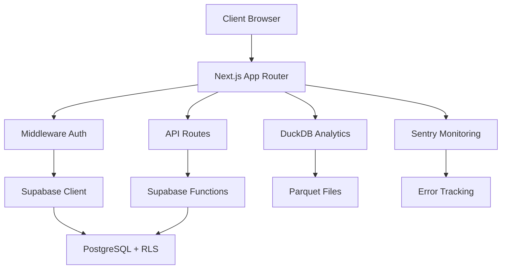

# 🏋️ 22Club - Developer Portal

Benvenuto nel **Developer Portal** di 22Club, la piattaforma completa per la gestione di centri fitness.

## 🎯 Panoramica

22Club è una **piattaforma multi-tenant SaaS** che permette ai personal trainer e ai centri fitness di gestire:

- 👥 **Atleti e clienti** con profili completi
- 📅 **Appuntamenti e sessioni** di allenamento
- 📄 **Documenti e file** condivisi
- 📊 **Analisi e metriche** di performance
- 💰 **Gestione pagamenti** e fatturazione
- 📱 **App mobile** per atleti

## 🏗️ Architettura

### Stack Tecnologico

| Layer          | Tecnologia            | Versione |
| -------------- | --------------------- | -------- |
| **Frontend**   | Next.js               | 15.x     |
| **Styling**    | TailwindCSS           | 4.x      |
| **Database**   | Supabase (PostgreSQL) | 2.74.x   |
| **Analytics**  | DuckDB                | 0.9.x    |
| **Testing**    | Vitest + Playwright   | 1.x      |
| **Monitoring** | Sentry                | 10.x     |
| **Deployment** | Vercel                | -        |

### Architettura Multi-Tenant



## 🚀 Quick Start

### Prerequisiti

- Node.js 18+
- npm o yarn
- Account Supabase
- Account Vercel (per deployment)

### Installazione

```bash
# Clona il repository
git clone https://github.com/22Club/22club.git
cd 22club

# Installa dipendenze
npm install

# Configura environment
cp env.example .env.local
# Modifica .env.local con le tue credenziali

# Avvia in sviluppo
npm run dev
```

### Configurazione Database

```bash
# Applica migrazioni Supabase
npx supabase db push

# Genera tipi TypeScript
npx supabase gen types typescript --local > src/types/supabase.ts
```

## 📁 Struttura Progetto

```
22club/
├── src/
│   ├── app/                 # Next.js App Router
│   ├── components/          # Componenti React
│   │   ├── shared/         # Componenti condivisi
│   │   ├── dashboard/      # Componenti dashboard PT
│   │   └── athlete/        # Componenti atleta
│   ├── lib/                # Utilities e helpers
│   ├── hooks/              # React hooks
│   ├── types/              # TypeScript types
│   └── config/             # Configurazioni
├── supabase/               # Database e migrazioni
├── docs/                   # Documentazione
├── .storybook/            # Storybook config
└── tests/                 # Test suite
```

## 🎨 Design System

22Club utilizza un **design system unificato** basato su:

- **Colori**: Palette personalizzata con tema scuro/chiaro
- **Tipografia**: Geist Sans + Geist Mono
- **Spacing**: Sistema 8px grid
- **Componenti**: Radix UI + TailwindCSS
- **Icone**: Lucide React

### Esempi Componenti

```tsx
// KPI Card
<KpiCard
  label="Allenamenti"
  value="12"
  trend="up"
  trendValue="+8%"
/>

// Appointments Card
<AppointmentsCard
  appointments={appointments}
  title="Prossimi Appuntamenti"
  showViewAll={true}
/>
```

## 🧪 Testing

### Test Unitari

```bash
npm run test:unit
```

### Test E2E

```bash
npm run test:e2e
```

### Coverage

```bash
npm run test:coverage
```

## 📚 Documentazione

- **[Storybook](http://localhost:6006)** - Componenti UI interattivi
- **[API Reference](api-reference.md)** - Documentazione API
- **[Architettura](architecture.md)** - Dettagli tecnici
- **[Deployment](deployment/)** - Guide deployment

## 🤝 Contribuire

1. Fork del repository
2. Crea feature branch (`git checkout -b feature/amazing-feature`)
3. Commit delle modifiche (`git commit -m 'Add amazing feature'`)
4. Push al branch (`git push origin feature/amazing-feature`)
5. Apri Pull Request

## 📄 Licenza

Questo progetto è sotto licenza MIT. Vedi [LICENSE](LICENSE) per dettagli.

## 🆘 Supporto

- 📧 Email: dev@22club.it
- 💬 Discord: [22Club Community](https://discord.gg/22club)
- 🐛 Issues: [GitHub Issues](https://github.com/22Club/22club/issues)

---

**Sviluppato con ❤️ dal team 22Club**
