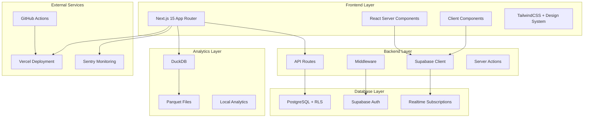
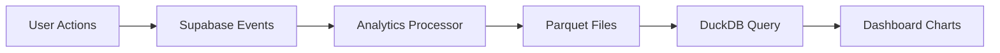
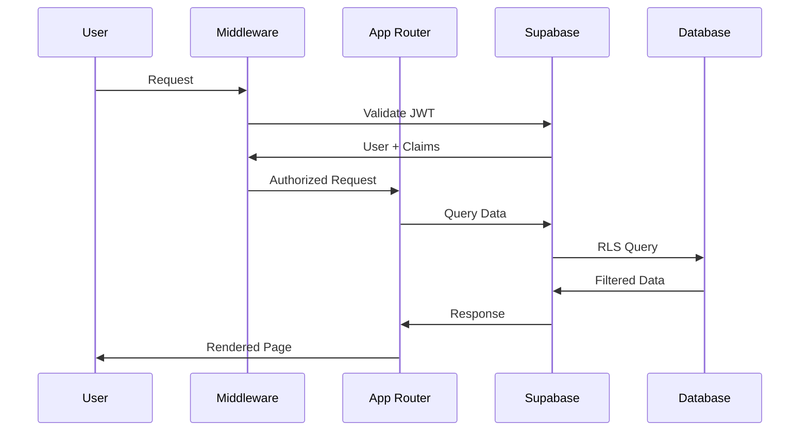

# 🧱 Architettura 22Club

22Club è una piattaforma **multi-tenant SaaS** basata su **Next.js + Supabase + TailwindCSS + DuckDB**.

## 🏗️ Architettura Generale

### Layer Principali



## 🎯 Principi Architetturali

### 1. Multi-Tenancy

- **Isolamento dati** per `org_id`
- **Row Level Security (RLS)** in Supabase
- **Middleware** per controllo accessi
- **JWT claims** personalizzati

### 2. Server-First

- **React Server Components** per performance
- **Streaming** e **Suspense** per UX
- **Edge Runtime** per middleware
- **Static Generation** dove possibile

### 3. Type Safety

- **TypeScript strict** mode
- **Generated types** da Supabase
- **Zod validation** per API
- **End-to-end** type safety

## 🗄️ Database Architecture

### Schema Principale

```sql
-- Organizzazioni (tenants)
CREATE TABLE organizations (
  id uuid PRIMARY KEY DEFAULT gen_random_uuid(),
  name text NOT NULL,
  created_at timestamptz DEFAULT now()
);

-- Profili utenti
CREATE TABLE profiles (
  id uuid PRIMARY KEY REFERENCES auth.users(id),
  org_id uuid REFERENCES organizations(id),
  role text CHECK (role IN ('owner', 'staff', 'athlete')),
  full_name text,
  email text,
  created_at timestamptz DEFAULT now()
);

-- Appuntamenti
CREATE TABLE appointments (
  id uuid PRIMARY KEY DEFAULT gen_random_uuid(),
  org_id uuid REFERENCES organizations(id),
  athlete_id uuid REFERENCES profiles(id),
  trainer_id uuid REFERENCES profiles(id),
  time_start time,
  time_end time,
  status text,
  created_at timestamptz DEFAULT now()
);
```

### Row Level Security (RLS)

```sql
-- Policy per isolamento multi-tenant
CREATE POLICY "Users can only see their org data"
  ON appointments FOR ALL
  USING (org_id = (
    SELECT org_id FROM profiles
    WHERE id = auth.uid()
  ));
```

## 🎨 Frontend Architecture

### App Router Structure

```
src/app/
├── (auth)/              # Route group per autenticazione
│   ├── login/
│   └── register/
├── dashboard/           # Dashboard PT
│   ├── page.tsx
│   ├── layout.tsx
│   └── appointments/
├── home/               # Home atleta
│   ├── page.tsx
│   └── layout.tsx
├── api/                # API routes
│   ├── auth/
│   └── web-vitals/
└── globals.css
```

### Component Architecture

```
src/components/
├── shared/             # Componenti condivisi
│   ├── ui/            # Design system base
│   ├── dashboard/     # Componenti dashboard
│   └── analytics/     # Componenti analytics
├── dashboard/          # Componenti specifici PT
└── athlete/           # Componenti specifici atleta
```

### State Management

- **Server State**: Supabase + React Query
- **Client State**: React Context + useState
- **Form State**: React Hook Form + Zod
- **Cache**: In-memory + React Query

## ⚙️ Backend Architecture

### API Routes

```typescript
// src/app/api/auth/context/route.ts
export async function POST(request: Request) {
  const { role, org_id } = await request.json()

  // Aggiorna profilo utente
  const { error } = await supabase.from('profiles').update({ role, org_id }).eq('id', user.id)

  return Response.json({ success: !error })
}
```

### Middleware

```typescript
// src/middleware.ts
export async function middleware(request: NextRequest) {
  const { supabase } = createClient(request)
  const {
    data: { session },
  } = await supabase.auth.getSession()

  // Controllo autenticazione
  if (!session && !isPublicRoute) {
    return NextResponse.redirect('/login')
  }

  // Controllo ruoli
  if (session && !hasPermission(role, pathname)) {
    return NextResponse.redirect('/unauthorized')
  }
}
```

## 📊 Analytics Architecture

### DuckDB Integration

```typescript
// src/lib/analytics.ts
import { DuckDB } from 'duckdb'

export class AnalyticsEngine {
  private db: DuckDB

  async queryWorkoutData(orgId: string) {
    return this.db.all(`
      SELECT * FROM parquet_scan('data/workouts/*.parquet')
      WHERE org_id = '${orgId}'
    `)
  }
}
```

### Data Flow



## 🔒 Security Architecture

### Authentication Flow

1. **Login** → Supabase Auth
2. **JWT Token** → Custom claims (role, org_id)
3. **Middleware** → Token validation
4. **RLS** → Database access control

### Data Protection

- **Encryption**: TLS in transit, AES at rest
- **Access Control**: RLS + JWT claims
- **Audit Trail**: Logging completo
- **Input Validation**: Zod schemas

## 🚀 Deployment Architecture

### Vercel Configuration

```typescript
// vercel.json
{
  "functions": {
    "src/app/api/**/*.ts": {
      "runtime": "nodejs18.x"
    }
  },
  "env": {
    "NEXT_PUBLIC_SUPABASE_URL": "@supabase-url",
    "SUPABASE_SERVICE_ROLE_KEY": "@supabase-service-key"
  }
}
```

### CI/CD Pipeline

```yaml
# .github/workflows/deploy.yml
name: Deploy
on:
  push:
    branches: [main]

jobs:
  deploy:
    runs-on: ubuntu-latest
    steps:
      - uses: actions/checkout@v3
      - name: Deploy to Vercel
        uses: amondnet/vercel-action@v20
        with:
          vercel-token: ${{ secrets.VERCEL_TOKEN }}
```

## 📈 Performance Architecture

### Optimization Strategies

1. **Server Components** per ridurre JS bundle
2. **Streaming** per caricamento progressivo
3. **Caching** con React Query + Supabase
4. **Code Splitting** automatico Next.js
5. **Image Optimization** con Next.js Image

### Monitoring

- **Sentry** per error tracking
- **Vercel Analytics** per performance
- **Supabase Metrics** per database
- **Custom metrics** per business logic

## 🔄 Data Flow

### User Journey



## 🎯 Scalability

### Horizontal Scaling

- **Vercel Edge** per distribuzione globale
- **Supabase** per database scaling
- **CDN** per asset statici
- **Microservices** per funzionalità specifiche

### Vertical Scaling

- **Database indexing** per query performance
- **Caching layers** per ridurre load
- **Connection pooling** per database
- **Memory optimization** per analytics

---

Questa architettura garantisce **scalabilità**, **sicurezza** e **performance** per la piattaforma 22Club.
