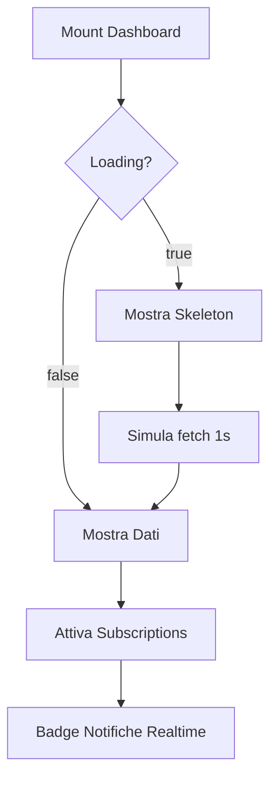

# Dashboard Staff - Documentazione Tecnica

## Panoramica

La Dashboard Staff (`/dashboard`) è il pannello di controllo principale per Personal Trainer e Amministratori. Fornisce una visione d'insieme in tempo reale dell'attività della palestra, con KPI chiave, agenda giornaliera e azioni rapide.

---

## Architettura

### File Principali

- **`src/app/dashboard/page.tsx`**: Pagina principale con layout e orchestrazione componenti
- **`src/components/dashboard/kpi-card.tsx`**: Card KPI interattive con count-up animato
- **`src/components/dashboard/sidebar.tsx`**: Sidebar con navigazione e badge notifiche realtime
- **`src/components/dashboard/agenda-timeline.tsx`**: Timeline appuntamenti giornalieri
- **`src/components/dashboard/action-drawers.tsx`**: Quick actions FAB con drawer

### Dipendenze Chiave

- **Next.js 15.5.4** (App Router, React 19)
- **Supabase** (realtime subscriptions, RLS)
- **Tailwind CSS v4** con tema Apple Dark Pro
- **React Hooks**: `useState`, `useEffect`, `useMemo`, `useCallback`

---

## Componenti

### 1. KPI Cards

**File**: `src/components/dashboard/kpi-card.tsx`

#### Funzionalità

- **Count-up animato**: valori numerici con easing `easeOutCubic` (800ms)
- **Navigazione**: supporto `href` (Next.js Link con prefetch) o `onClick`
- **Badge status**: colorati per stato (success/warning/error/info)
- **Accessibilità**: `role="button"`, `tabIndex`, `aria-label`, navigazione tastiera (Enter/Space)

#### Props

```typescript
interface KPICardProps {
  title: string
  value: string | number
  icon: string
  status: 'success' | 'warning' | 'error' | 'info'
  statusText: string
  onClick?: () => void
  href?: string
  loading?: boolean
}
```

#### Stati

- **Loading**: skeleton con `animate-pulse`
- **Loaded**: animazione count-up + badge status
- **Hover**: `scale-105`, `shadow-lg`, `shadow-glow`
- **Focus**: ring brand visibile per accessibilità

#### Esempio

```tsx
<KPICard
  title="Clienti attivi 💪"
  value={24}
  icon="👥"
  status="success"
  statusText="+3 questa settimana"
  href="/dashboard/clienti"
  loading={false}
/>
```

---

### 2. Sidebar con Badge Notifiche Realtime

**File**: `src/components/dashboard/sidebar.tsx`

#### Funzionalità

- **Navigazione**: 13 route principali con icone emoji
- **Badge notifiche**: conteggio messaggi non letti in tempo reale
- **Subscription Supabase**: ascolta INSERT/UPDATE su `chat_messages`
- **Indicatore attivo**: `bg-brand` + `glow` per route corrente

#### Stati Notifiche

1. **Caricamento iniziale**: query `chat_messages` con `.is('read_at', null)`
2. **Realtime**: channel `notifications_realtime` con postgres_changes
3. **Update ottimistico**: ricarica conteggio su ogni evento
4. **Display**: badge `error` con `animate-pulse`, mostra `99+` se count > 99

#### Esempio Badge

```tsx
{
  showBadge && (
    <Badge variant="error" size="sm" rounded className="animate-pulse">
      {notificationCount > 99 ? '99+' : notificationCount}
    </Badge>
  )
}
```

#### Cleanup

- `useEffect` con `mounted` flag per evitare memory leak
- `supabase.removeChannel()` in cleanup function

---

### 3. Agenda Timeline

**File**: `src/components/dashboard/agenda-timeline.tsx`

#### Funzionalità

- **Timeline verticale**: appuntamenti ordinati per orario
- **Status indicator**: completed/in-progress/scheduled con colori
- **Skeleton loader**: durante caricamento (prop `loading`)
- **Azione rapida**: bottone "+ Nuovo Appuntamento"

#### Mockup Data (da sostituire con fetch reale)

```typescript
const mockAgendaData = [
  {
    id: '1',
    time: '09:00',
    athlete: 'Mario Rossi',
    type: 'allenamento' as const,
    status: 'completed' as const,
    description: 'Upper Body - Panca piana',
  },
  // ...
]
```

---

### 4. Quick Actions (FAB)

**File**: `src/components/dashboard/action-drawers.tsx`

#### Funzionalità

- **4 FAB buttons**: Appuntamento, Scheda, Pagamento, Documento
- **Posizione fissa**: `right-6 top-1/2 -translate-y-1/2`
- **Drawer modali**: form per creazione rapida (attualmente disabled)
- **Accessibilità**: `aria-label`, `role="group"`, emoji con `aria-hidden="true"`

#### Esempio

```tsx
<Button
  variant="primary"
  size="icon-lg"
  onClick={() => openDrawer('appointment')}
  aria-label="Crea nuovo appuntamento"
>
  <span aria-hidden="true">📅</span>
</Button>
```

---

## Layout Responsive

### Breakpoints (Tailwind + Custom CSS)

| Breakpoint | Dimensione | Layout KPI         | Sidebar       |
| ---------- | ---------- | ------------------ | ------------- |
| Mobile     | < 640px    | 1 colonna (stack)  | Hidden/drawer |
| Small      | 640px+     | 2 colonne (grid)   | Hidden/drawer |
| Tablet     | 768px+     | 2 colonne (span 6) | Fissa 64px    |
| Desktop    | 1024px+    | 4 colonne (span 3) | Fissa 64px    |

### CSS Custom Classes

```css
@media (min-width: 640px) {
  .dashboard-grid {
    display: grid;
    grid-template-columns: repeat(2, 1fr);
    gap: 1rem;
  }
  .dashboard-kpi {
    grid-column: span 1;
  }
}

@media (min-width: 1024px) {
  .dashboard-kpi {
    grid-column: span 3; /* 4 colonne totali */
  }
}
```

---

## Ottimizzazioni Performance

### 1. Memoization

```typescript
// KPI data memoizzato per evitare ricreazione
const mockKPIData = useMemo(() => [...], [])

// Handler stabili con useCallback
const handleAddAppointment = useCallback(() => {
  console.log('Add appointment clicked')
}, [])
```

### 2. Prefetch Rotte Critiche

```typescript
useEffect(() => {
  router.prefetch('/dashboard/clienti')
  router.prefetch('/dashboard/calendario')
  router.prefetch('/dashboard/pagamenti')
  router.prefetch('/dashboard/documenti')
}, [router])
```

### 3. Skeleton Loader

- Riduce perceived latency durante fetch
- `aria-busy="true"` + `aria-live="polite"` per screen reader
- Transizione smooth da skeleton a contenuto reale

---

## Stati e Flussi

### Flusso di Caricamento



### Stati KPI Card

1. **Idle**: non montato
2. **Loading**: skeleton + `animate-pulse`
3. **Animating**: count-up attivo (800ms)
4. **Ready**: valore finale + interattività
5. **Hover/Focus**: scale + glow

### Stati Notifiche Sidebar

1. **Initial Load**: query DB per count iniziale
2. **Listening**: subscription attiva su chat_messages
3. **Update**: nuovo messaggio → ricarica count
4. **Display**: badge visibile solo se count > 0
5. **Cleanup**: unmount → rimuovi channel

---

## Errori e Gestione

### Possibili Errori

1. **Supabase connection fail**
   - **Sintomo**: badge notifiche a 0, skeleton infinito
   - **Mitigazione**: console.error + fallback graceful
   - **Fix**: verificare `.env.local` e RLS policies

2. **RPC `get_conversation_participants` non trovata**
   - **Sintomo**: 404 su fetch conversazioni
   - **Mitigazione**: fallback su query diretta `chat_messages`
   - **Fix**: eseguire migration `20241220_chat_messages.sql`

3. **React not defined** (già risolto)
   - **Causa**: missing `import React from 'react'` in `kpi-card.tsx`
   - **Fix**: aggiunto import esplicito

### Logging

```typescript
catch (err) {
  console.error('Error loading notifications:', err)
  // Non bloccare UI, fallback su count=0
}
```

---

## Testing

### Test E2E Playwright (TODO)

```typescript
test('Dashboard loads KPI cards', async ({ page }) => {
  await page.goto('/dashboard')
  await expect(page.locator('.dashboard-kpi')).toHaveCount(4)
})

test('Notifiche badge updates realtime', async ({ page }) => {
  await page.goto('/dashboard')
  // Simula invio messaggio in background
  // Verifica badge incremento
})
```

### Test A11y

- **Focus ring**: visibile su tutti i KPI + FAB
- **Screen reader**: aria-label descrittivi, role corretti
- **Keyboard nav**: Tab + Enter/Space funzionanti

---

## Prossimi Sviluppi

### Sprint 2 - SSR e API

- [ ] SSR "Prossimi Appuntamenti" con `revalidate: 60`
- [ ] API `/api/dashboard/stats` con Zod validation
- [ ] Rate limiting su endpoint pubblici

### Sprint 3 - Responsive Avanzato

- [ ] Sidebar drawer per <1024px con focus trap
- [ ] Gesture swipe su mobile per aprire/chiudere drawer
- [ ] Tooltip informativi su hover FAB

### Sprint 4 - Analytics

- [ ] Web vitals tracking (TTI, CLS, FCP)
- [ ] Lighthouse target: A11y ≥ 95, Performance ≥ 90
- [ ] Session replay su errori critici

---

## Riferimenti

- **Design System**: Apple Dark Pro (vedi `src/app/globals.css`)
- **Componenti UI**: `src/components/ui/`
- **Supabase Migrations**: `supabase/migrations/`
- **Hooks Custom**: `src/hooks/`

---

## Changelog

| Data       | Versione | Modifiche                                        |
| ---------- | -------- | ------------------------------------------------ |
| 2025-01-08 | 1.0.0    | Initial release con KPI, sidebar, agenda         |
| 2025-01-08 | 1.1.0    | Aggiunto badge notifiche realtime                |
| 2025-01-08 | 1.2.0    | Prefetch rotte + memoization performance         |
| 2025-01-08 | 1.3.0    | Responsive grids 1-2-4 colonne, skeleton loaders |
| 2025-01-08 | 1.4.0    | A11y migliorata: aria-label, role, keyboard nav  |

---

**Autore**: Cursor AI Assistant  
**Progetto**: 22Club Fitness Management  
**Licenza**: Proprietaria
